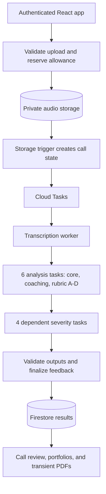

# KESP: Call Analysis and Agent Coaching

KESP helps supervisors review recorded calls, understand agent performance, and
generate coaching reports. This isolated demo uses fictional identities and
sanitized reconstructions with replacement voices, not original customer audio.

**[Open the demo](https://kesp-demo-tonylai2789.web.app/login)**

## Privacy Note

Some bank-specific prompts, scoring policies, and operational details have been
removed or replaced with **Info redacted** placeholders to protect privacy and
confidential information. Original customer recordings and records are not
included. The demo uses fictional identities and sanitized replacement audio;
the public source shows the engineering without exposing private evaluation rules.

## Try It

Choose username/password sign-in with **`demo-supervisor`** and the reviewer
password supplied separately by Tony. The account has supervisor permissions;
there is no public signup. Passwords and provider keys are not in this repository.

1. Open **Calls** to inspect completed feedback, scores, and audio evidence.
2. Open **Call analyzer** or **Manual profiles**, select the reconstructed agent,
   and choose **All** to view its ten historical calls.
3. Open **PDF reports**, select that agent, and use **September 21-27, 2026** for
   the sample weekly report. Daily reports are available for dates in that week.

Names, identifiers, transcripts, and evidence text are masked in the interface.
The underlying recordings are also sanitized. Scores, coaching feedback, timing,
and replacement audio remain available so reviewers can explore the workflow.

New uploads and paid portfolio generation depend on the processing status shown
in the app. When paused or out of allowance, use existing calls and manual PDFs.
The paid portfolio pattern report is separate from daily/weekly PDF generation.

## Public Source Boundaries

**Info redacted:** private evaluation prompts and bank-specific rubric-policy
assets are deliberately omitted. Their placeholders do not contain working
grading rules, and no substitute rules or weights have been invented.

The hosted demo uses an authorized private runtime bundle. This public source
shows the application, orchestration, access controls, budget enforcement, and
reporting architecture; deploying it alone does **not** reproduce the private
analysis behavior. Self-hosting analysis requires separately supplied compatible
policy assets. Build/deployment checks fail explicitly when those are missing.

This is a clean source snapshot. Earlier private operational history, bank
recordings, source-to-demo mappings, credentials, and generated deployment
artifacts are not part of its Git history. See [redaction notes](docs/PUBLIC-SOURCE.md).

## Tools

| Layer | Tools |
| --- | --- |
| Frontend | React, TypeScript, Vite, Tailwind CSS, Radix UI |
| Hosting and login | Firebase Hosting and Authentication |
| Backend | Node.js 22, Cloud Functions v2, Cloud Tasks |
| Data and secrets | Firestore, private Cloud Storage, Secret Manager |
| Model providers | ElevenLabs Scribe transcription, OpenAI analysis |
| Media, PDFs, tests | FFmpeg/FFprobe, PDFKit, Jest, Firebase emulators |

## Backend Flow

The browser submits an authorized upload and observes saved progress. Processing
does not depend on one long browser request.

Subagents are logical jobs on shared workers, not ten separately deployed
services. Firestore stores task state; Cloud Tasks handles bounded asynchronous
work. Generation checks reject stale results, output guards protect persistence,
and recovery is bounded. Manual PDFs reuse stored analysis without new model calls.

Start with `web/functions/src/triggers.ts`, `processingTaskWorkers.ts`, and
`analysisSubagents.ts`. Private policy boundaries are marked in the public source.

## Access and Abuse Controls

- Server-enforced account and role checks; supervisor cannot manage users.
- Only the Call analyzer workspace is exposed; Panel and automation are absent.
- Authenticated audio playback; legacy bearer download tokens were revoked.
- Upload limit: five minutes and 25 MiB; at most two active calls.
- Shared USD25 provider allowance with transactional reservations. No browser
  control can increase or reset it; unknown charges remain reserved for review.

Authenticated callable APIs also enforce shared and per-account limits:

| Requests | Per account | Across the demo |
| --- | --- | --- |
| All callables | 60/min; 5,000/day | 180/min; 10,000/day |
| Paid actions | 6/hour; 20/day | 12/hour; 40/day |
| PDF generation | 6/min; 60/day | 12/min; 120/day |

Everyone using the reviewer login shares its limits. These controls are not a
DDoS shield or a hard cap on all Firebase infrastructure charges. Keep the
reviewer password restricted and revoke access when review ends.

## Checks and Limitations

Use Node.js 22 and npm; authorization emulators also require Java 21 and Firebase
CLI. See [verification notes](docs/RELEASE-VERIFICATION.md) for current results,
reproducible commands, and which checks require the private runtime assets.

The hosted examples used Scribe v2 and GPT-5.4; each call stores its model choice.
The demo excludes automatic bank ingestion, production batch replay, scheduled
processing, outbound email, and original customer recordings. Its short samples
do not exercise the retained long-audio chunking path.

AI coding tools assisted implementation, debugging, testing, and documentation.
Models provide transcription and analysis; the application provides orchestration,
validation, access control, and reporting. Tests do not establish that every
model judgment is correct. The demo is not a security certification or a lending
decision system.
